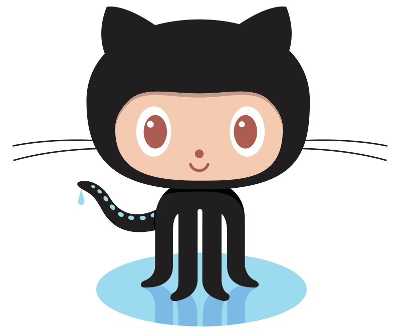

<!-- Readme Start here -->

<!-- Load logo from readme/logo.jpg -->

  

<!-- Title -->
<h1 align="center" style="border: none">
Helmet Integrated Impact Detection System (HI-IDS)
</h1>

<!-- Shield IO - very nice icons -->

[![Contributors][contributors_shield]][contributors_url]
[![Forks][forks_shield]][forks_url]
[![Stargazers][stars_shield]][stars_url]
[![Issues][issues_shield]][issues_url]
[![MIT License][license_shield]][license_url]
[![LinkedIn][linkedin_shield]][linkedin_url]

<!-- Description -->
In this project, the goal was to create a prototype of an impact detection system. The accelerometer is powered by a portable battery and programmed in such a way as to detect the amount of force inflicted on the helmet. This continuous data is, then, sent toward the mobile app to be plotted. A threshold value is set so that if the force exceeds the concussion level, a warning will be displayed on the app. Additionally, other screens were also set up to display basic information about the projects and team members inside the app. 

<!-- Include externals file that you need to run the program -->
 ## Demo 
 - [Testing][Video]
 - [Mobile App]

<!-- Include your major tools and frameworks -->
## Built With
Software:
- [C++][C++]
- [Javascript][js]
- [Arduino IDE][Arduino IDE]
- [Android Studio][Android]
##
Hardware:
- [Aruduino Nano 33 BLE][Nano]
- [Accelerometer][ADXL337]
- [Battery][Battery]
- [Helmet][Helmet]

<!-- Authors information -->
## Author
- [Socheath Sok][github]
- Calvin Lee
- Jasmine Arrieta
- Rhyan Gonzalez

<!-- License -->
## License
This project is licensed under the MIT License - see the [LICENSE][license_url] file for details

<!-- Shoutout to other projects, plugin, or minor tools -->
 ## Acknowledgments
Special thank to
- [Source for project idea][Reference]

<!-- Course -->
## Course
- [EE 400D - Electrical Engineering Design Project][course]

<!-- References -->
<!-- Shield Icons-->
[contributors_shield]: https://img.shields.io/github/contributors/SocheathSok/Automatic-Maze-Navigation-System.svg?style=for-the-badge
[forks_shield]: https://img.shields.io/github/forks/SocheathSok/Automatic-Maze-Navigation-System.svg?style=for-the-badge
[stars_shield]: https://img.shields.io/github/stars/SocheathSok/Automatic-Maze-Navigation-System.svg?style=for-the-badge
[issues_shield]: https://img.shields.io/github/issues/SocheathSok/Automatic-Maze-Navigation-System.svg?style=for-the-badge
[license_shield]: https://img.shields.io/github/license/SocheathSok/Automatic-Maze-Navigation-System.svg?style=for-the-badge
[linkedin_shield]: https://img.shields.io/badge/-LinkedIn-black.svg?style=for-the-badge&logo=linkedin&colorB=555

<!-- Shield URLs -->
[contributors_url]: https://github.com/SocheathSok/Automatic-Maze-Navigation-System/graphs/contributors
[forks_url]: https://github.com/SocheathSok/Automatic-Maze-Navigation-System/network/members
[stars_url]: https://github.com/SocheathSok/Automatic-Maze-Navigation-System/stargazers
[issues_url]: https://github.com/SocheathSok/Automatic-Maze-Navigation-System/issues
[license_url]: https://github.com/SocheathSok/Automatic-Maze-Navigation-System/blob/master/LICENSE
[linkedin_url]: https://www.linkedin.com/in/socheath-sok-010822240/

<!-- Other URLs -->
[github]: https://github.com/socheathsok
[course]: http://catalog.csulb.edu/preview_course_nopop.php?catoid=5&coid=40951
[Video]: https://mega.nz/file/AHUwgZZb#tcqhxrfINuTJXR5NxMqklZfutIDx3MLeCqxFvkEQLRE
[C++]: https://www.cplusplus.com/doc/tutorial/
[js]: https://www.javascript.com/
[Arduino IDE]: https://www.arduino.cc/en/software
[Android]: https://developer.android.com/studio
[Nano]: http://store.arduino.cc/products/arduino-nano-33-ble
[ADXL337]: https://learn.sparkfun.com/tutorials/adxl337-and-adxl377-accelerometer-hookup-guide/all
[Battery]: https://www.sweetwater.com/store/detail/SB902A--shure-sb902a-rechargeable-lithium-ion-battery
[Helmet]: https://www.amazon.com/Riddell-Victor-Youth-Helmet-X-Large/dp/B07CVCSCGR/ref=sr_1_1?c=ts&keywords=Football+Helmets&qid=1654408527&s=team-sports&sr=1-1&ts_id=3410681
[Mobile App]: https://github.com/SocheathSok/HI_IDS_Final/tree/master/Mobile%20App
[Reference]: https://learn.sparkfun.com/tutorials/raspberry-pi-zero-helmet-impact-force-monitor

[Best-README-Template]: https://github.com/othneildrew/Best-README-Template

